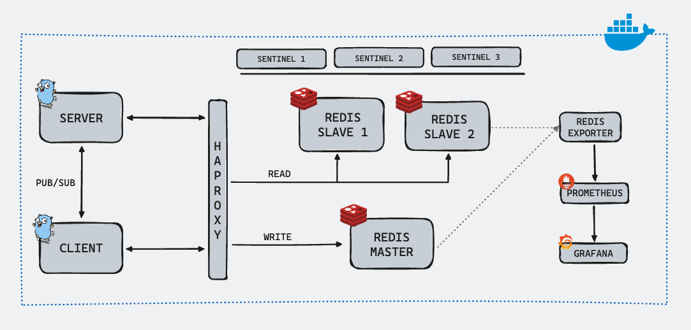

# Redis Sentinel Pub/Sub Demo



This repository demonstrates the working of Redis with Sentinel for high availability, Redis Exporter for monitoring, and Pub/Sub systems. The setup includes Redis master and slave instances, Sentinel for failover management, HAProxy for load balancing, Prometheus and Grafana for monitoring, and simple publisher and subscriber applications.

## Table of Contents

- [Architecture](#architecture)
- [Usage](#usage)
  - [Starting the Services](#starting-the-services)
  - [Stopping the Services](#stopping-the-services)
  - [Cleaning Up](#cleaning-up)
  - [Inserting Mock Data](#inserting-mock-data)
  - [Benchmarking](#benchmarking)
- [Monitoring](#monitoring)
- [Scenarios](#scenarios)
  - [Scenario 1: Redis Master Failure](#scenario-1-redis-master-failure)
  - [Scenario 2: Sentinel Elects a New Master](#scenario-2-sentinel-elects-a-new-master)
  - [Scenario 3: Network Partition](#scenario-3-network-partition)
  - [Scenario 4: Sentinel Quorum Failure](#scenario-4-sentinel-quorum-failure)
  - [Scenario 5: Sentinel Restart](#scenario-5-sentinel-restart)
  - [Scenario 6: Redis Slave Failure](#scenario-6-redis-slave-failure)
  - [Scenario 7: Haproxy Failure](#scenario-7-haproxy-failure)
  - [Scenario 8: Redis Master Recovery](#scenario-8-redis-master-recovery)

## Architecture

The architecture of this demo includes the following components:

- **Redis Master**: Primary Redis instance.
- **Redis Slaves**: Two Redis slave instances replicating from the master.
- **Redis Sentinel**: Three Sentinel instances monitoring the Redis master and slaves.
- **HAProxy**: Load balancer to distribute traffic among Redis instances.
- **Redis Exporter**: Exporter to gather Redis metrics.
- **Prometheus**: Monitoring system to collect metrics from Redis Exporter.
- **Grafana**: Dashboard for visualizing the metrics collected by Prometheus.
- **Publisher**: A simple Go application to publish messages.
- **Subscriber**: A simple Go application to subscribe to messages.

## Usage

### Starting the Services

To start the services, run:

```sh
make start
```

This command will build and start all the services defined in the `docker-compose.yaml` file.

### Stopping the Services

To stop the services, run:

```sh
make stop
```

### Cleaning Up

To stop and remove all containers, networks, and volumes, run:

```sh
make clean
```

### Inserting Mock Data

To insert mock data into Redis, run:

```sh
make redis-mock-data
```

### Benchmarking

To benchmark the Redis setup, run:

```sh
make redis-benchmark
```

## Monitoring

Prometheus and Grafana are used for monitoring the Redis instances.

- Prometheus is accessible at `http://localhost:9090`
- Grafana is accessible at `http://localhost:3000` (default login: `admin` / `admin`)

## Scenarios

### Scenario 1: Redis Master Failure

**What happens when Redis master fails?**

When the Redis master fails, the Sentinels detect the failure. Sentinels are configured to monitor the Redis instances. Once the master is down, Sentinels start a failover process to elect a new master among the slaves.

### Scenario 2: Sentinel Elects a New Master

**How does Sentinel elect a new master?**

1. **Failure Detection**: Sentinels continuously monitor the Redis master. When a Sentinel cannot communicate with the master for a specified time (SENTINEL_DOWN_AFTER), it marks the master as down.
2. **Quorum**: The failure is confirmed if a majority of Sentinels (based on SENTINEL_QUORUM) agree that the master is down.
3. **Failover**: Sentinels then select one of the slaves to promote to master. This new master is chosen based on the Sentinel’s failover election process, which considers factors like the latest replication offset.
4. **Configuration Update**: Sentinels update their configurations to point to the new master, and the remaining slaves are reconfigured to replicate from the new master.

### Scenario 3: Network Partition

**How does the system handle a network partition?**

If a network partition occurs, the Sentinels might split into two groups, each believing the other group is down. This can lead to a scenario where both groups try to elect a new master. To avoid split-brain scenarios:

- Sentinels require a majority quorum to elect a new master.
- HAProxy will route traffic to the correct master based on the current Sentinel configurations.

### Scenario 4: Sentinel Quorum Failure

**What happens if there is a Sentinel quorum failure?**

If there are not enough Sentinels to form a quorum (e.g., if two out of three Sentinels fail), failover cannot proceed:

- The system remains in read-only mode if the master is down.
- Monitoring and alerting should be in place to notify administrators to manually intervene and restore Sentinel quorum.

### Scenario 5: Sentinel Restart

**What happens when a Sentinel instance is restarted?**

When a Sentinel instance restarts, it performs the following steps:

1. **Reconnection**: The restarted Sentinel reconnects to the Redis instances and other Sentinel nodes.
2. **Synchronization**: It synchronizes its state with other Sentinel nodes to get updated information about the current master and slaves.
3. **Monitoring Resumption**: The restarted Sentinel resumes its monitoring duties, participating in quorum and failover processes as needed.

### Scenario 6: Redis Slave Failure

**What happens when a Redis slave fails?**

When a Redis slave fails:

1. **Failure Detection**: Sentinels detect the failure and mark the slave as down.
2. **Master Unaffected**: The Redis master continues to operate normally, and the remaining slave(s) continue replicating from the master.
3. **Reconfiguration**: Once the failed slave is back online, it reconnects to the master and resynchronizes its data.

### Scenario 7: HAProxy Failure

**What happens when HAProxy fails?**

When HAProxy fails:

1. **Service Disruption**: Clients lose the ability to connect to Redis through the HAProxy load balancer.
2. **Manual Intervention**: An administrator needs to restart the HAProxy service to restore load balancing.
3. **High Availability**: In a production environment, running multiple HAProxy instances with failover mechanisms can mitigate this risk.

### Scenario 8: Redis Master Recovery

**What happens when the original Redis master recovers after a failover?**

When the original Redis master recovers after a failover:

1. **Rejoin as Slave**: The recovered master does not automatically become the master again. Instead, it joins the cluster as a slave of the current master.
2. **Data Synchronization**: The recovered instance synchronizes its data with the new master to ensure consistency.
